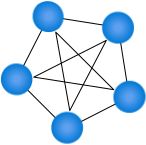

# Loại mạng và cấu trúc liên kết để sử dụng khi bạn thiết kế mạng

Tất cả các mạng đều được xây dựng trên các nguyên tắc giống nhau. Bạn có thể áp dụng các nguyên tắc này để thiết kế và xây dựng mạng cục bộ hoặc mạng dựa trên đám mây của tổ chức mình. Khi bạn xây dựng một mạng, bạn cần biết về các loại mạng khác nhau, cấu trúc liên kết của chúng và cách sử dụng của chúng.

Trong phần này, bạn sẽ khám phá một số loại cấu trúc liên kết mạng phổ biến được sử dụng để tạo mạng dựa trên internet.

## Mạng là gì?

Mạng là một tập hợp các thiết bị hỗ trợ mạng, thường được tạo thành từ máy tính, thiết bị chuyển mạch, bộ định tuyến, máy in và máy chủ. Mạng là một phần cơ bản của cuộc sống hàng ngày và tồn tại trong nhà, nơi làm việc và các khu vực công cộng. Mạng cho phép tất cả các loại thiết bị hỗ trợ mạng giao tiếp.

## Các loại mạng

Các mạng khác nhau về kích thước, hình dạng và cách sử dụng. Để giúp dễ dàng xác định các loại mạng khác nhau, chúng được phân loại thành một trong các loại mạng sau:

- Mạng khu vực cá nhân (Personal area networks - PAN)
- Mạng cục bộ (Local area networks - LAN)
- Mạng lưới khu vực đô thị (Metropolitan area networks - MAN)
- Mạng diện rộng (Wide area networks - WAN)

## Mạng khu vực cá nhân là gì?

Mạng khu vực cá nhân (PAN) cung cấp các nhu cầu kết nối mạng xung quanh một cá nhân. Ví dụ về PAN là nơi điện thoại thông minh, đồng hồ thông minh, máy tính bảng và máy tính xách tay đều kết nối và chia sẻ dữ liệu mà không cần kết nối với điểm truy cập hoặc các dịch vụ mạng của bên thứ ba khác. Mạng PAN thường sử dụng Bluetooth để giao tiếp vì nó cung cấp khả năng chia sẻ dữ liệu trong phạm vi ngắn, năng lượng thấp. Các tiêu chuẩn mạng liên quan đến PAN là Bluetooth và IEEE 802.15.

## Mạng cục bộ là gì?

Mạng cục bộ (LAN) cung cấp các nhu cầu kết nối mạng xung quanh một vị trí duy nhất. Vị trí này có thể là văn phòng của tổ chức, trường học, trường đại học, bệnh viện, sân bay và nhiều địa điểm khác. Mạng LAN thường thuộc sở hữu tư nhân và cần xác thực và ủy quyền để truy cập. Trong số các cách phân loại mạng khác nhau, cho đến nay mạng LAN là mạng được sử dụng phổ biến nhất.

## Mạng vùng đô thị là gì?

Mạng khu vực đô thị (MAN) cung cấp khả năng kết nối mạng giữa hai địa điểm khác nhau trong một thành phố hoặc khu vực đô thị để cung cấp một mạng mở rộng duy nhất. Thông thường, MAN yêu cầu một kết nối chuyên dụng và an toàn giữa mỗi mạng LAN được kết nối với MAN.

## Mạng diện rộng là gì?

Mạng diện rộng (WAN) cung cấp khả năng kết nối mạng giữa hai vị trí địa lý khác nhau tại địa phương hoặc trên toàn thế giới. Ví dụ, mạng WAN được sử dụng để kết nối trụ sở chính của tổ chức với các văn phòng chi nhánh trên toàn quốc. Một mạng WAN liên kết nhiều mạng LAN với nhau để tạo ra một siêu mạng. Với mạng WAN, bạn sử dụng mạng riêng ảo (VPN) để quản lý kết nối giữa các mạng LAN khác nhau.

## Sự khác biệt giữa mạng LAN và mạng WAN

Một số khía cạnh đặt mạng LAN khác với mạng WAN. Biết những mục này giúp bạn lập kế hoạch triển khai các dịch vụ trên các mạng này dễ dàng hơn.

| LAN | WAN |
|:----|:----|
| Mạng LAN là một mạng do tư nhân vận hành thường được chứa trong một tòa nhà duy nhất. | Mạng WAN được sử dụng để kết nối các văn phòng cách biệt về địa lý với nhau. Nhiều tổ chức có thể vận hành mạng WAN. |
| Mạng LAN hoạt động ở tốc độ 10 Gbps trở lên. | Mạng WAN thường hoạt động ở tốc độ dưới 1 Gbps. |
| Mạng LAN ít bị tắc nghẽn hơn so với các loại mạng khác. | Mạng WAN bị tắc nghẽn nhiều hơn so với các loại mạng khác. |
| Một mạng LAN có thể được quản lý và điều hành trong nhà. | Mạng WAN thường yêu cầu sử dụng bên thứ ba để cấu hình và thiết lập, điều này làm tăng chi phí. |

## Cấu trúc liên kết mạng

Cấu trúc liên kết mạng mô tả thành phần vật lý của mạng. Hãy xem xét bốn cấu trúc liên kết mà bạn có thể chọn khi thiết kế mạng LAN:

- Mạng tuyến tính (Bus)
- Mạng vòng (Ring)
- Mạng hình lưới (Mesh)
- Mạng hình sao (Star)

### Cấu trúc liên kết tuyến tính (Bus Topology)

Trong cấu trúc liên kết bus, mỗi thiết bị mạng được kết nối với một cáp mạng duy nhất. Mặc dù đây là loại mạng đơn giản nhất để triển khai, nhưng nó cũng có những hạn chế. Hạn chế đầu tiên là chiều dài của cáp chính hoặc bus. Càng để lâu, khả năng bỏ qua tín hiệu càng cao. Hạn chế này hạn chế bố cục vật lý của mạng. Tất cả các thiết bị phải được đặt gần nhau; ví dụ, trong cùng một phòng. Cuối cùng, nếu đứt cáp bus, toàn bộ mạng sẽ bị lỗi.

### Cấu trúc liên kết vòng (Ring Topology)

Trong cấu trúc liên kết vòng, mỗi thiết bị mạng được kết nối với hàng xóm của nó để tạo thành một vòng. Dạng mạng này linh hoạt hơn so với cấu trúc liên kết bus. Việc đứt vòng cáp cũng ảnh hưởng đến hoạt động của mạng.

### Cấu trúc liên kết lưới (Mesh Topology)

Cấu trúc liên kết lưới được mô tả như một lưới vật lý hoặc một lưới logic.

Trong một lưới vật lý, mỗi thiết bị mạng kết nối với mọi thiết bị mạng khác trong mạng. Nó làm tăng đáng kể khả năng phục hồi của mạng, nhưng có chi phí vật lý để kết nối tất cả các thiết bị. Ngày nay rất ít mạng được xây dựng như một mạng lưới đầy đủ. Hầu hết các mạng sử dụng một phần lưới, nơi một số máy kết nối với nhau, nhưng những máy khác kết nối thông qua một thiết bị.

Có một sự khác biệt nhỏ giữa mạng lưới vật lý và mạng lưới logic. Nhận thức rằng hầu hết các mạng hiện đại đều dựa trên mạng lưới, vì mỗi thiết bị có thể nhìn thấy và giao tiếp với bất kỳ thiết bị nào khác trên mạng. Điều này mô tả một mạng lưới lôgic và chủ yếu được thực hiện thông qua việc sử dụng các giao thức mạng.

### Cấu trúc liên kết hình sao (Star Topology)

Cấu trúc liên kết hình sao là cấu trúc liên kết mạng được sử dụng phổ biến nhất. Mỗi thiết bị mạng kết nối với một trung tâm hoặc bộ chuyển mạch tập trung. Các thiết bị chuyển mạch và trung tâm có thể được liên kết với nhau để mở rộng và xây dựng các mạng mở rộng hơn. Cho đến nay, loại hình này là mạnh mẽ nhất và có thể mở rộng.

## Ethernet

Ethernet là một tiêu chuẩn mạng đồng nghĩa với mạng LAN dựa trên dây và cũng được sử dụng trong mạng MAN và WAN. Ethernet đã thay thế các công nghệ mạng LAN có dây khác như ARCNET và Token Ring và là một tiêu chuẩn công nghiệp.

Mặc dù Ethernet được liên kết với mạng có dây, hãy nhớ rằng nó không giới hạn ở dây, vì nó cũng được sử dụng qua các liên kết cáp quang.

Tiêu chuẩn Ethernet xác định một khuôn khổ để truyền dữ liệu, xử lý lỗi và ngưỡng hiệu suất. Nó mô tả các quy tắc để cấu hình mạng Ethernet và cách mỗi phần tử trong mạng tương tác với nhau.

Ethernet được sử dụng trong mô hình OSI ở các lớp liên kết dữ liệu và vật lý. Nó tạo cơ sở cho Tiêu chuẩn IEEE 802.3. Tiêu chuẩn này đã giúp thống nhất phát triển mạng và phần cứng.

Ethernet là một tiêu chuẩn liên tục phát triển và phiên bản gốc hỗ trợ tốc độ truyền dữ liệu chỉ 2,94 Mbps. Trong những năm gần đây, một số phiên bản lặp lại đã được phát hành để bắt kịp với nhu cầu về tốc độ ngày càng tăng. Ngày nay, tốc độ mở rộng lên đến 400 Gbps.

### Fast Ethernet

Fast Ethernet (IEEE 802.3u) được phát triển để hỗ trợ tốc độ truyền dữ liệu lên đến 100 Mbps. Ethernet nhanh hơn còn được gọi là tiêu chuẩn 100BASE-TX.

### Gigabits Ethernet

Gigabit Ethernet (IEEE 802.3ab) được phát triển để hỗ trợ các mạng truyền thông nhanh hơn có thể hỗ trợ các dịch vụ như truyền phát đa phương tiện và Thoại qua IP (VoIP). Chuẩn 1000BASE-T chạy nhanh hơn 10 lần so với chuẩn 100BASE-TX. Gigabit Ethernet hiện đã được đưa vào các tiêu chuẩn 802.3 và được khuyến nghị cho các mạng doanh nghiệp. Tiêu chuẩn mới tương thích ngược với 100BASE-T và các tiêu chuẩn 10BASE-T cũ hơn.

### 10 Gigabit Ethernet

Chuẩn 10 Gigabit Ethernet (IEEE 802.3ae) có tốc độ truyền dữ liệu danh nghĩa là 10 Gbps, nhanh hơn 10 lần so với người tiền nhiệm của nó. Việc cải thiện tốc độ này chỉ có thể thực hiện được bằng cách sử dụng sợi quang. Tiêu chuẩn hiện nay yêu cầu các mạng Ethernet 10 Gigabit sử dụng định tuyến dựa trên khu vực thay vì truyền dữ liệu đến tất cả các nút. Bằng cách đó, nhiễu mạng và lưu lượng được giảm thiểu.

### Terabit Ethernet

Terabit Ethernet cung cấp tốc độ truyền dữ liệu 200 Gbps và 400 Gbps. Dự kiến, Terabit Ethernet sẽ cung cấp tốc độ 800 Gbps và 1,6 Tbps trong tương lai.

## Mạng trong Azure

Azure đi kèm với một số công cụ và dịch vụ mạng.

### Mạng ảo Azure

Biểu đồ thể hiện thiết kế mạng ảo với máy chủ web và máy chủ SQL được gán địa chỉ IP từ dải mạng ảo để cô lập các máy chủ.

Sử dụng Mạng ảo Azure, bạn có thể xây dựng các mạng ảo phức tạp mô phỏng cấu trúc của các mạng tại chỗ thực tế của bạn. Bạn có thể cung cấp và quản lý các mạng ảo dựa trên đám mây của mình. Bạn cũng có thể tạo các mạng ảo kết hợp tích hợp với các mạng tại chỗ của mình khi bạn sử dụng Azure Virtual Network.

### Dịch vụ kết nối

Khi bạn cần kết nối băng thông cao, độ trễ thấp giữa mạng tại chỗ và phiên bản Mạng ảo Azure của mình, bạn có hai tùy chọn. Bạn có thể sử dụng kết nối VPN qua cổng Azure hoặc bạn có thể sử dụng kết nối chuyên dụng thông qua Azure ExpressRoute. ExpressRoute là một dịch vụ điểm-điểm an toàn. Để sử dụng dịch vụ này, bạn sẽ sử dụng đối tác kết nối bên thứ ba để thay mặt bạn cung cấp và lưu trữ các mạch ExpressRoute.

[Bài tiếp theo: Các loại thiết bị mạng sẽ sử dụng khi bạn xây dựng mạng](/network-infrastructure.md)
